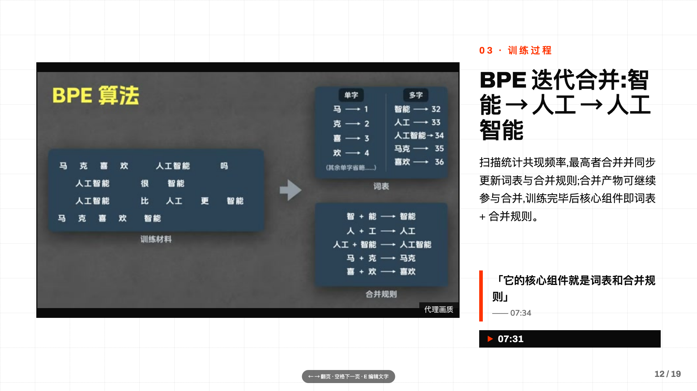
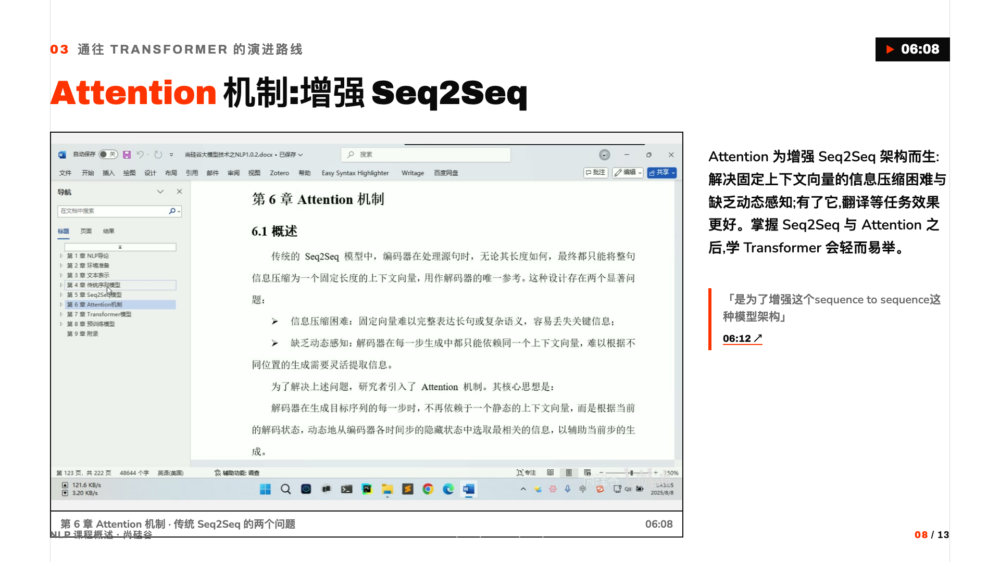
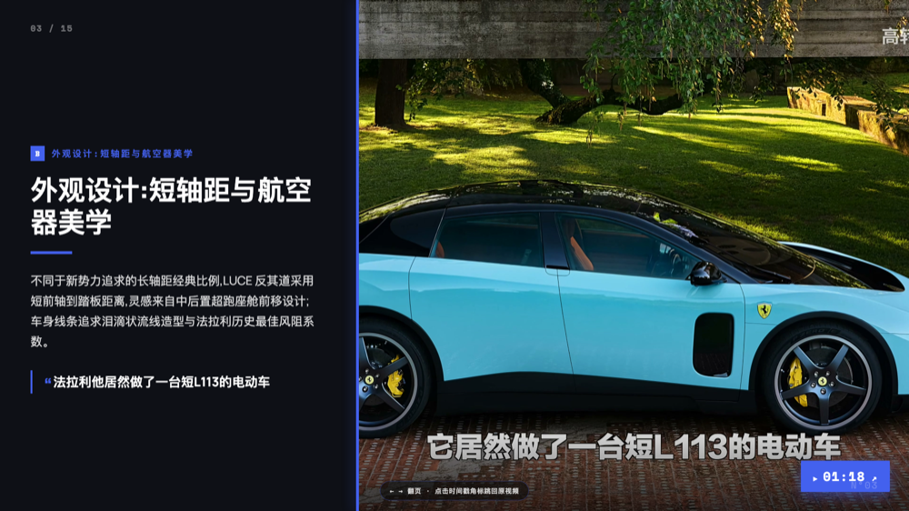

<div align="center">

# video2slides

**把任意视频转成自包含、可回放的幻灯片——每一帧、每一句都深链回源视频的那一刻。**

一个可移植的**智能体技能(agent skill）**（Claude Code 及其他智能体运行时），它*替你看完整段视频*:转写、带证据引用地列大纲、挑选关键帧,再渲染成可一键跳回视频的幻灯片或可导航笔记。

[English](./README.md) | 中文


<br/>

<!-- Live demo 托管在 GitHub Pages;下面的图片链到可交互的成品 deck。 -->
[](https://caomaocao.github.io/video2slides/token/)
[](https://caomaocao.github.io/video2slides/nlp/)
[](https://caomaocao.github.io/video2slides/mbs/)
[](https://caomaocao.github.io/video2slides/ferrari/)

**▶ 在线演示**,四种视觉形态的真实成品 —— [讲义型课程](https://caomaocao.github.io/video2slides/token/) · [文档录屏课程](https://caomaocao.github.io/video2slides/nlp/) · [建筑纪录片](https://caomaocao.github.io/video2slides/mbs/) · [汽车评测](https://caomaocao.github.io/video2slides/ferrari/)。点任意时间戳角标即可跳进源视频。

</div>

---

## 为什么需要 video2slides

一段好的技术视频信息密度很高——一节 40 分钟的课,本身就是一套讲义、一份逐字稿,外加十几个「看**这一帧**」的瞬间,却全被锁在一条得来回拖动的时间轴里。想略读只能拖进度条,想引用只能手动截图,想整理成笔记只能每十秒暂停一次。

**video2slides 把这些压进一趟流程。** 给它一个链接或一个文件,它就产出一份 deck(或笔记),其中:

- 每一页都是讲者真正讲到的一个要点,并配一句来自逐字稿的**原文引用**——不编造摘要;
- 每一**帧**都是该要点**对的那一帧**,从视频里抽出并去重,而非随手一张缩略图;
- 每一个**时间戳角标**都深链回源视频里的那一秒。

它不是字幕工具,也不是套在 YouTube 上的摘要器。它构建的是一份**视频索引文档**——`大纲 ↔ 逐字稿 ↔ 帧` 的持久、自包含映射,而幻灯片与笔记只是这份文档的*视图*。

## 特性

- **📥 多来源** —— YouTube、B 站(单 P 与 `?p=` 分 P 合集)、本地文件(`file://` 播放 + 页内跳播)。
- **🗣️ 字幕**或** ASR** —— 有字幕就直接用(**无需 API key**);没有则回退到语音转写,内置三大可插拔后端家族(whisper 风格转写 API、chat/base64 音频 API、纯本地 **FunASR**)。
- **🧭 两轴理解** —— 判定**画面形态**(讲义 / 录屏 / 口播 / 影视化)与**体裁**,依据是场景变化曲线、边缘密度、逐字稿与平台元数据。
- **🔖 证据引用大纲** —— 每个大纲节点必须引用逐字稿里的真实一句;无法核实的节点降级为纯文字,绝不编造。
- **🖼️ 智能选帧** —— 单趟 ffmpeg 解码里按节点定向抽帧,RGB 滑窗去重(能抓 A-B-A 切镜),模糊/文字密度打分,再拼成 contact sheet——让宿主每章只 Read 一张图,而非上百张。
- **📄 交付的是制品,不只是渲染** —— 导出 `video_index.json` + `frames/`:自包含、带版本、**经 schema 校验**的索引文档。幻灯片与笔记都是下游视图,文档本身才是产物。
- **🎞️ 两个渲染器** —— 固定 1920×1080 的 HTML **幻灯片**(经 [`frontend-slides`](https://github.com/zarazhangrui/frontend-slides) 技能渲染)和/或可导航的 **markdown 笔记**(`scripts/notes.py`,零额外依赖)。
- **⏱️ 处处深链** —— 角标跳向 `youtube.com/watch?v=…&t=`、`bilibili.com/video/BV…?p=n&t=`,本地文件则弹出内嵌 `<video>` 并跳到该时刻。
- **📚 长视频友好** —— 超过 30 分钟的视频按章生成大纲,再全局合并。
- **♻️ 可续跑** —— 所有中间制品落在 `.work/`;每层若产物比上游新则自动跳过(`--force` 强制重跑)。
- **🌐 优雅降级** —— 纯文本(非多模态)宿主仍能产出完整索引 + 笔记;只有幻灯片视图需要能读图的模型。
- **🪶 近零依赖** —— 纯标准库 Python;唯二必需的外部二进制是 `ffmpeg`/`ffprobe` 与 `yt-dlp`。不用 PIL / OpenCV / PaddleOCR——所有图像处理都走 ffmpeg。

## 工作原理

确定性脚本负责重活与可复现的部分;**宿主智能体**负责语义判断。二者通过结构化制品交接——上一个脚本的 stdout 直接喂给智能体的下一步决策。

```
                 YouTube  ·  B 站  ·  本地文件
                                │
                        ┌───────▼───────┐
                        │   fetch.py    │  yt-dlp → ~360p 代理流
                        └───────┬───────┘  + 字幕 · 章节 · 热度 · 弹幕 · 元数据
                                │
                 ┌──────────────┴──────────────┐
                 ▼                              ▼
         ┌───────────────┐              ┌───────────────┐
         │ transcribe.py │              │  signals.py   │
         │  字幕 / ASR   │              │ 一趟 ffmpeg
         └───────┬───────┘              │ → 场景分曲线
                 │                      └───────┬───────┘
                 └──────────────┬───────────────┘
                                ▼
                       ┌─────────────────┐
                       │   宿主智能体    │  轴 A:画面形态    轴 B:体裁
                       │     (分析)     │  每个节点都带原文引用的层级大纲
                       └────────┬────────┘
                                ▼
                        ┌───────────────┐
                        │   frames.py   │  按节点选帧 · 去重 · 模糊/文字打分
                        └───────┬───────┘  · contact sheet → 宿主挑最优
                                ▼
                 ╔══════════════════════════════╗
                 ║      video_index.json        ║   公开契约:
                 ║          +  frames/          ║   逐字稿 ↔ 大纲 ↔ 帧
                 ╚═══════════════╤══════════════╝   (自包含 · 带版本 · schema 校验)
                        ┌────────┴────────┐
                        ▼                 ▼
               ┌─────────────────┐  ┌─────────────┐
               │ frontend-slides │  │   notes.py  │
               │   HTML deck     │  │  markdown   │
               └────────┬────────┘  └──────┬──────┘
                        └────────┬─────────┘
                                 ▼
                时间戳角标深链回源视频里的那一秒
```

整条流水线**零打断**:分析从头跑到尾,不问你任何问题。全程只有一个交互点——在索引文档导出之后、渲染之前——询问产出形态、篇幅与语言。

## 快速开始

### 1. 前置依赖

| 依赖 | 用途 | 安装 |
|---|---|---|
| **ffmpeg / ffprobe** ≥ 5.1 | 代理流、场景信号、抽帧 | macOS:`brew install ffmpeg`;Linux:发行版包管理器 |
| **yt-dlp** ≥ 2026.7 | 取在线视频 + 字幕 | macOS:`brew install yt-dlp`;Linux:`pipx install yt-dlp` |
| **node** 或 **deno** | 仅 YouTube 需要(解其 JS 挑战) | `brew install node`,或发行版 / `deno` 安装器 |
| **tesseract**(*可选*) | 文字密度选帧打分(缺失则降级为边缘密度代理) | `brew install tesseract` |

> **平台:** macOS(Apple Silicon / Intel)与 Linux(arm64 / x86_64)。**不支持原生 Windows**——请用 WSL2(会上报为 Linux,正常运行)。

任何时候都可跑内置预检,它会告诉你缺什么、并给出按平台适配的安装提示:

```bash
python3 scripts/setup.py
```

### 2. 作为技能安装

video2slides 是一个**智能体技能**,不是独立 CLI——由宿主智能体调用。把仓库放进你的智能体技能目录,技能会按 `description` 自动触发:

- **Claude Code / Desktop** —— 放进你的技能目录即可。
- **Codex** —— `~/.agents/skills/video2slides/`(或仓库内 `.agents/skills/`)。
- **OpenClaw** —— `~/.agents/skills/video2slides/`;`SKILL.md` 必须实体拷贝(软链逃逸守卫会拒绝软链),`scripts/`/`schemas/`/`assets/` 可软链。

然后直接对你的智能体说,例如:*「把这个视频转成幻灯片:`<url>`」*。

### 3. 可选:幻灯片渲染器

**幻灯片**输出经独立的 [`frontend-slides`](https://github.com/zarazhangrui/frontend-slides) 技能渲染(零依赖、反「AI 味」的 1920×1080 deck 生成器)。想要 deck 就装它。**不装它,video2slides 依然产出完整的 `video_index.json` + 可导航 markdown 笔记**——只是没有幻灯片视图而已。

### 4. 可选:ASR 后端(用于无字幕视频)

已带字幕的视频**无需 API key**。其余情况在 `~/.config/video2slides/.env`(权限 `0600`,绝不入库)配一个后端:

```bash
ASR_BACKEND=funasr          # 纯本地、免 key;或:groq | openai | api | mimo | qwen
# API 家族另读:ASR_API_BASE / ASR_API_KEY / ASR_MODEL
# funasr 另读:FUNASR_VENV(独立 venv,与本项目依赖隔离)
```

## 使用

装好后,通过你的智能体用自然语言驱动:

> *「把这节课做成幻灯片:https://www.youtube.com/watch?v=…」*
> *「把 `/path/to/talk.mp4` 转成笔记。」*

技能会不打断地跑完整条流水线,然后只问**一次**:

- **形态** —— 幻灯片 · markdown 笔记 · 两者 · 仅索引文档(*默认:幻灯片*)
- **篇幅** —— 短(5–10)· 中(10–20)· 长(20+)——两个渲染器共用的展开深度档位
- **语言** —— 默认跟随视频语言,可随意覆盖(证据引用始终保持原文一字不差)

产物默认落在 `~/Desktop/video2slides/<title>_<date>/`:一个自包含目录(`video_index.json`、`frames/`、`index.html` 和/或 `notes.md`),可原样搬移或分享。

## 产物:视频索引文档

一等交付物是 **`video_index.json` + `frames/`**——单个 JSON 内嵌全量逐字稿(带显式 `timestamp_granularity`)、大纲树,以及选中的代理分辨率帧(相对路径 + 去重标注)。它经 [`schemas/video_index.schema.json`](./schemas/video_index.schema.json) 校验,并带 `schema_version` 供消费方判断兼容性。

下游一切——幻灯片、笔记,或你自己的工具——都只读这份文档。换风格、换篇幅、换语言重渲染都是**零重跑分析**的成本;分析永不跑第二遍。

完整设计原理见 [`docs/video2slides-spec-v0.5.md`](./docs/video2slides-spec-v0.5.md)。

## 配置:ASR 后端

| 家族 | 预设 | 时间戳 | 说明 |
|---|---|---|---|
| **transcriptions** | `groq` · `openai` · `api` | 原生 segment 级 | whisper 风格 multipart 上传;`api` 经 `ASR_API_BASE`/`ASR_API_KEY`/`ASR_MODEL` 配置 |
| **chat** | `mimo` · `qwen` | 45 秒块级 | chat/completions + base64 音频;粗粒度时间戳由大纲/QA 层补偿 |
| **funasr** | *(本地)* | 句级 | 经子进程跑在独立 venv(`FUNASR_VENV`);arm64 / x86_64 Mac 可用,免 key |
| **none** | —— | —— | 仅限带字幕视频;需要 ASR 时会带清晰提示停止 |

音频在上传前按静音中点切块,逐块失败隔离。B 站字幕为 AI 字幕轨,需登录 cookie(`--cookies-from-browser chrome`,headless 宿主用导出的 `cookies.txt`)。

## 致谢

- [`frontend-slides`](https://github.com/zarazhangrui/frontend-slides),作者 [@zarazhangrui](https://github.com/zarazhangrui) —— 本技能交接的幻灯片渲染器。
- [`yt-dlp`](https://github.com/yt-dlp/yt-dlp) 与 [`ffmpeg`](https://ffmpeg.org/) —— 承担全部取流与媒体处理的两个二进制。
- [FunASR](https://github.com/modelscope/FunASR) —— 本地语音识别后端。

## 许可

[MIT](./LICENSE) © 2026 caomaocao。

> 上方演示 deck 由第三方视频构建,仅作展示用途;其画面版权归原作者所有。
